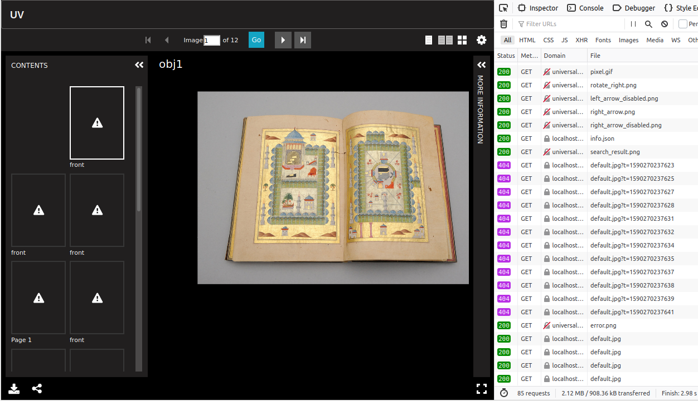
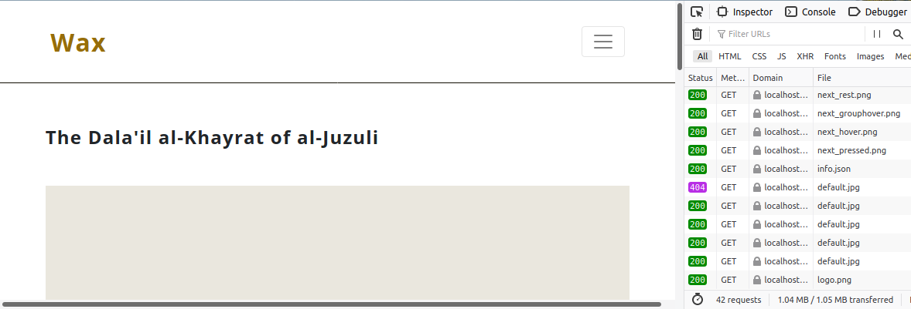

# postwax
Some post-processing workarounds for minicomp/wax 

Here are a couple of rake tasks that can be included in a [Wax](https://github.com/minicomp/wax) project. They may eventually be packaged as a gem or incorporated into Wax itself, or be shown to be unnecessary (e.g. if they can be addressed through configuration options within Wax or within clients). Currently they help with two different problems:

- ```postwax:level0_workarounds```: this generates and copies some images to meet the needs of IIIF clients that make requests that are outside the IIIF Level 0 support that wax supplies (see [below](#user-content-demo-of-problems) for screenshots). Currently there are two:
  
  - generate 90-width thumbnail images, since [Universal Viewer](https://universalviewer.io) requests these by default.
  - deal with the ambiguous placement of resized full images, which can be found under ```/full/``` or under ```/0,0,<max x>,<max y>/```. Wax (via iiif_wax) generates different images in these locations, and some clients (such as OpenSeadragon) sometimes request them from the wrong location. This task copies the contents of ```/0,0,<max x>,<max y>/``` in ```/full/```.

- ```postwax:merge_manifests```: this is a first step toward providing paged manifests for Wax collections, or for sub-sets of collections. Currently it simply creates a manifest at ```img/derivatives/iiif/bigitem.json``` containing all the images in the Wax project. 

  - TODO: 
    - handle Wax collections separately
    - populate item-level metadata
    - manage sub-sets of collections, perhaps grouping by prefix in the pids
    - add item-level pages

Some Wax issues might benefit from these workarounds (or from better solutions to these problems): [minicomp/wax#66](https://github.com/minicomp/wax/issues/66), [minicomp/wax#74](https://github.com/minicomp/wax/issues/74), [minicomp/wax#78](https://github.com/minicomp/wax/issues/78)

## Installation and use

- copy ```postwax.rake``` into ```lib/tasks``` in a Wax project
- add this line to Wax's ```Rakefile```:

```
Dir.glob("lib/tasks/*.rake").each { |r| load r } 
```

While this is under development, you'll need to add ```gem 'byebug'``` to Wax's ```Gemfile```
and run ```bundle install```.

Now when you run bundle exec rake --tasks, you should see:

```
rake postwax:level0_workarounds  # Generate 90-width thumbnails, as request...
rake postwax:merge_manifests     # Merge image-level manifests to create it...
rake wax:derivatives:iiif        # generate iiif derivatives from local ima...
rake wax:derivatives:simple      # generate iiif derivatives from local ima...
rake wax:pages                   # generate collection md pages from yaml o...
rake wax:search                  # build lunr search index (with default UI...
rake wax:test                    # run htmlproofer, rspec if .rspec file ex...
```

After running ```wax:derivatives:iiif```, run ```postwax:level0_workarounds``` and ```postwax:merge_manifests```.

To see the result, start Wax locally with ```bundle exec jekyll s```, and then view the manifest 
```http://127.0.0.1:4000/CKB-binder-7/img/derivatives/iiif/bigitem.json``` in the demo pages for 
[Universal Viewer](https://universalviewer.io/) or [Mirador](https://projectmirador.org/demo/). 
If you do that before running ```postwax:level0_workarounds```, you'll see the problems which the 
workarounds are supposed to address.


## Demo of problems

An out-of-the-box instance of Wax was used, and ```postwax:merge_manifests``` was run to generate the paged manifest. 

### Universal Viewer thumbnails in paged manifest



Doesn't work: http://localhost:4000/wax/img/derivatives/iiif/images/obj1/full/90,/0/default.jpg

Fails because ```/90,/``` isn't available.

### OpenSeadragon full-image requests

When the window is small, OpenSeadragon sometimes requests a non-existent full image size, and the image fails to appear.



Doesn't work: http://localhost:4000/wax/img/derivatives/iiif/images/obj1/full/501,/0/default.jpg

Fails because the ```/501,/``` size is not generated under ```/full/``` but rather under ```/0,0,4001,2704/```

Works: http://localhost:4000/wax/img/derivatives/iiif/images/obj1/0,0,4001,2704/501,/0/default.jpg
